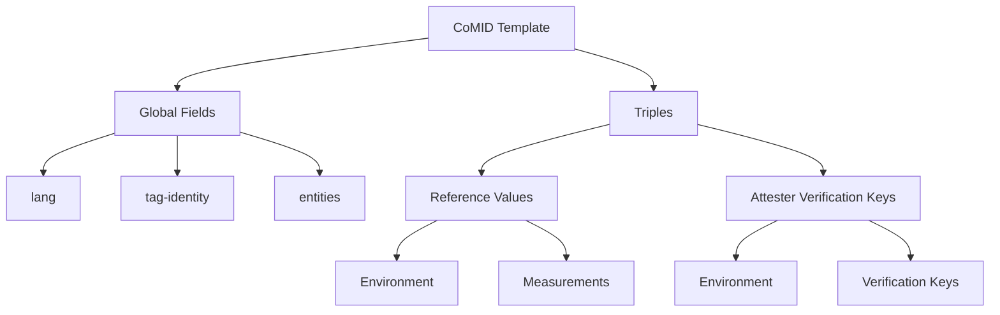
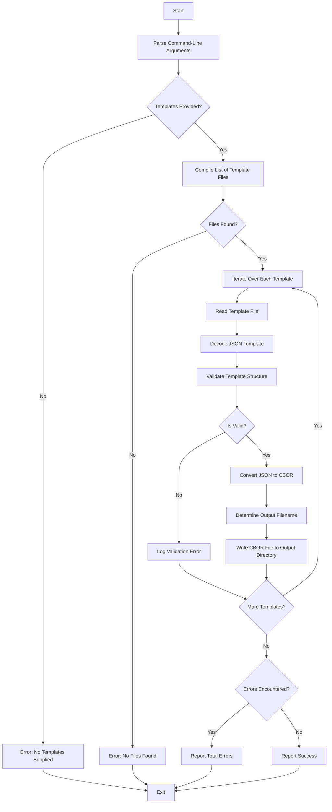

# CoMID Template Format

##  Introduction

**CoMID (Concise Model Identifier)**,  is a structured tag that encapsulates detailed information about the composition of hardware, firmware, or modules. Each CoMID is uniquely identified by a specific ID, enabling unambiguous reference to CoMID instances, particularly in contexts such as typed link relations or CoBOM (Concise Bill of Material) tags.

##  Template Structure

A CoMID template is a JSON document composed of **top-level fields** and a **triples** object. The **top-level fields** provide overall identification, language, and authorship, while the **triples** object contains domain-specific data (e.g., reference values, attester keys).

```
{
  "lang": "<language-region>",
  "tag-identity": { ... },
  "entities": [ ... ],
  "triples": {
    "reference-values": [ ... ],
    "attester-verification-keys": [ ... ]
    ...
  }
}
``` 

###  Top-Level Fields

-   **lang** (`String`): Defines the language or locale (e.g., `"en-GB"`).
-   **tag-identity** (`Object`): Uniquely identifies this CoMID document via an ID (often a UUID) and includes a version number.
-   **entities** (`Array`): Lists the entities (organizations, individuals, etc.) contributing to or maintaining the document, along with their roles.

###  Triples

-   **reference-values**: One or more **reference-value** objects, each containing an **environment** and one or more **measurements**.
-   **attester-verification-keys**: One or more **attester-verification-key** objects, each containing an **environment** and an array of **attestation public key**.


##  Components

###  Environment

An **environment** captures the context of a measurement or verification key:

-   **class**: Vendor, model, and possibly an ID (`type` + `value`).
-   **instance** (`optional`): For distinguishing multiple instances of the same environment (e.g., using `ueid` or `uuid`).
-   **layer** and **index** (`optional`): For layered environments (e.g., DICE layers in multi-stage boot processes).

###  Measurements

Each measurement has two crucial subfields:

-   **key**: Identifies the measurement, including possible fields like `label`, `version`, and `signer-id`.
-   **value**: Holds the actual measurement data (e.g., cryptographic digests, raw values, or operational flags).

###  Attester Verification Keys

Used to store **public keys** associated with an environment. This is essential for verifying the attestation claims or measurement signatures produced by that environment.

##  Field-By-Field Explanation

###  Global Fields
|     Field    	|  Type  	|                       Description                       	|                    Example                   	|   	
|:------------:	|:------:	|:-------------------------------------------------------:	|:--------------------------------------------:	|
| lang         	| String 	| Language/country code.                                  	| "en-GB"                                      	|   	
| tag-identity 	| Object 	| Identity of this CoMID tag (UUID + version).            	| "id": "43BBE37F-2E61-4B33-AED3-53CFF1428B16" 	|   	
| entities     	| Array  	| The organizations/roles associated with this CoMID tag. 	| [ { "name": "ACME Ltd." ... } ]              	|   	

###  Reference-Value Fields
|        Field       |  Type  |                                     Description                                    |                                            Example                                            |
|:------------------:|:------:|:----------------------------------------------------------------------------------:|:---------------------------------------------------------------------------------------------:|
| environment        | Object | Contains class and optionally instance, layer, index.                              | See 3.1 Environment.                                                                          |
| measurements       | Array  | List of measurement objects.                                                       | [ { "key": { ... }, "value": { ... } } ]                                                      |
| measurements.key   | Object | Identifies the measurement. Could be a psa.refval-id, cca.platform-config-id, etc. | { "type": "psa.refval-id", "value": { "label": "BL", "version": "2.1.0", ... } }              |
| measurements.value | Object | Holds the actual measurement data.                                                 | { "digests": ["sha-256:..."] }, or { "raw-value": { "type": "bytes", "value": "..." } }, etc. |

###  Attester-Verification-Key Fields
|       Field       |  Type  |               Description               |                                   Example                                   |
|:-----------------:|:------:|:---------------------------------------:|:---------------------------------------------------------------------------:|
| environment       | Object | Defines the environment for these keys. | See 3.1 Environment.                                                        |
| verification-keys | Array  | Holds one or more public keys.          | [ { "type": "pkix-base64-key", "value": "-----BEGIN PUBLIC KEY-----..." } ] |
----------

###  High Level Structure for CoMID Templates



##  Full Examples and Walkthroughs

Below are the **seven** template files, each highlighting different aspects of CoMID usage.

###  comid-cca-mult-refval.json

[comid-cca-mult-refval.json](https://github.com/veraison/cocli/blob/0d8fae8210ae527589792de2fba54442302380f7/data/comid/templates/comid-cca-mult-refval.json#L1-L93)

**Key Points**

-   **Multiple Reference Values**: Demonstrates multiple reference values within a single environment.
-   **Identifier Types**: Uses `psa.impl-id` for environment identifier.
-   **Diverse Measurement Keys**: Showcases different measurement keys (`psa.refval-id` and `cca.platform-config-id`).
-   **Raw Values**: Includes raw byte values for platform configuration.

###  comid-cca-realm-refval.json

[comid-cca-realm-refval.json](https://github.com/veraison/cocli/blob/0d8fae8210ae527589792de2fba54442302380f7/data/comid/templates/comid-cca-mult-refval.json#L1-L93)

**Key Points**

-   **UUID Identifiers**: Utilizes `uuid` type for environment identifiers, ensuring uniqueness.
-   **Instance Field**: Includes an `instance` field of type `bytes` to differentiate instances.
-   **Integrity Registers**: Uses `integrity-registers` to hold multiple cryptographic hash values across different measurement registers (`rim`, `rem0`, `rem1`, etc.).
-   **Operational Flags**: Contains `op-flags` indicating properties like `notSecure` and `debug`.
-   **Software Version Number (svn)**: Specifies software versioning with exact values.

###  comid-cca-refval.json

[comid-cca-realm-refval.json](https://github.com/veraison/cocli/blob/0d8fae8210ae527589792de2fba54442302380f7/data/comid/templates/comid-cca-mult-refval.json#L1-L93)

**Key Points**

-   **Multiple Reference-Value Entries**: Illustrates handling of multiple reference values within a single CoMID.
-   **Operational Flags**: Uses `op-flags` to indicate operational states like `notSecure` and `debug`.
-   **Software Version Numbers (svn)**: Uses `svn` to specify exact software versions for each measurement.
-   **Layered Environments**: Demonstrates multi-layered environments (e.g., layer 0 and layer 1) with unique identifiers.
-   **Digest Arrays**: Shows multiple digest entries within a single measurement for enhanced integrity verification.

###  comid-dice-refval.json

[comid-cca-realm-refval.json](https://github.com/veraison/cocli/blob/0d8fae8210ae527589792de2fba54442302380f7/data/comid/templates/comid-cca-mult-refval.json#L1-L93)

**Key Points**

-   **DICE Framework Integration**: The file name `comid-dice-refval.json` suggests integration with the DICE framework, which utilizes layered measurements for enhanced security.
-   **Layered Measurements**: Contains multiple layers (`layer`: 0 and `layer`: 1), each with distinct environments and measurements.
-   **Operational Flags**: Includes flags like `notSecure` and `debug` to indicate the operational state of each environment.
-   **Software Version Numbers (svn)**: Uses `svn` to specify exact software versions for each measurement.
-   **Multiple Digests**: Some measurements contain multiple digests to strengthen integrity verification.

###  comid-psa-iakpub.json

[comid-cca-realm-refval.json](https://github.com/veraison/cocli/blob/0d8fae8210ae527589792de2fba54442302380f7/data/comid/templates/comid-cca-mult-refval.json#L1-L93)

**Key Points**

-   **Public Keys for Attestation**: Stores two **verification-keys** under different **instances** (`ueid`: Unique Entity Identifier), enabling attesters to verify measurements or claims.
-   **Key Formats**: Utilizes `pkix-base64-key` type, ensuring keys are in a standard PEM format.
-   **Consistent Environment Class**: Both verification keys are associated with the same `class` (`psa.impl-id`, `vendor`, `model`), indicating they belong to the same hardware or firmware class.
-   **Unique Instances**: Differentiates verification keys using unique `ueid` values, allowing multiple keys per environment.

### comid-psa-integ-iakpub.json

[comid-cca-realm-refval.json](https://github.com/veraison/cocli/blob/0d8fae8210ae527589792de2fba54442302380f7/data/comid/templates/comid-cca-mult-refval.json#L1-L93)

**Key Points**

-   **Integration with PSA**: The file name indicates integration with the Platform Security Architecture (PSA), emphasizing secure key management.
-   **Multiple Verification Keys**: Similar to `comid-psa-iakpub.json`, this file includes multiple verification keys, each associated with distinct `ueid` instances.
-   **Key Material Variations**: Demonstrates how different environments can have unique key materials, enhancing security through key separation.
-   **Consistent Class Definition**: Maintains the same `class` details across verification keys, ensuring they are recognized as part of the same environment.

###  comid-psa-refval.json

- https://github.com/veraison/cocli/blob/0d8fae8210ae527589792de2fba54442302380f7/data/comid/templates/comid-psa-refval.json#L1

**Key Points**

-   **Consistent Reference Values**: All reference values utilize the `psa.refval-id` type, maintaining consistency in measurement identification.
-   **Uniform Digest Algorithm**: Employs `sha-256` across all measurements, ensuring uniform integrity verification.
-   **Signer Identification**: Each measurement includes a `signer-id`, linking the digest to its trusted signer.
-   **Standard Structure**: Adheres to the standard CoMID structure for PSA-based reference values, facilitating interoperability and ease of verification.


###  Lifecycle of a CoMID Templates


