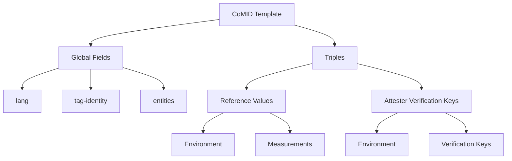

# CoRIM Template Format

##  Introduction

**CoRIM** stands for **Concise Reference Integrity Manifest**, a structured format for describing reference integrity information, such as profiles, validity windows, entities, and dependent reference integrity manifests (RIMs). CoRIM can be leveraged in **remote attestation** scenarios, where it provides crucial metadata enabling **Verifiers** to evaluate trust in an **Attester** (e.g., a device or platform).

##  Conceptual Overview

###  What Is CoRIM?

CoRIM is a **data model** that captures the high-level attributes of a reference integrity manifest, which might include:

-   **Profile URI** identifying a specification (e.g., CCA, PSA).
-   **Validity** period during which the manifest is considered valid.
-   **Entity** metadata describing organizations or roles in the manifest’s lifecycle.
-   **Dependent RIMs** that describe or reference additional manifests.

###  CoRIM in the RATS Architecture

In the **IETF RATS architecture** ([RFC9334](https://rfc-editor.org/rfc/rfc9334)), a **Verifier** appraises **Evidence** (the Attester’s state claims) against **Reference Values** or **Endorsements** (often created or authorized by an Endorser). CoRIM can be used:

-   **As a container for Reference Values**: A CoRIM can describe what valid states or configurations look like (e.g., version info, cryptographic digests).
-   **As part of an Endorsement**: Some Endorsers may package CoRIM data as “static claims” about a platform or firmware.
-   **To link multiple RIMs**: CoRIM’s `dependent-rims` field can chain or reference external manifests, aligning with the multi-layer approach in RATS.

##  Template Structure

A **CoRIM template** is frequently represented in JSON for **human-friendly editing**. At a minimum, it includes `corim-id` (a unique identifier). Optional fields like `profile`, `validity`, and `entities` provide deeper context:

```
{
  "corim-id": "<uuid>",
  "profile": "<profile-uri>",
  "validity": {
    "not-before": "<datetime>",
    "not-after": "<datetime>"
  },
  "entities": [ ... ],
  "dependent-rims": [ ... ]
}
``` 

###  Top-Level Fields

-   **corim-id** (String/UUID): A globally unique identifier for the CoRIM.
-   **profile** (String, optional): A URI referencing a particular standard (e.g., PSA, CCA).
-   **validity** (Object, optional): A time window (`not-before` / `not-after`) of when the manifest is valid.
-   **entities** (Array, optional): An array of organizations or roles involved.
-   **dependent-rims** (Array, optional): An array referencing other RIMs or manifest resources.

##  Key Components

###  Profile

-   **Type**: `String (URI)`
-   **Examples**:
    -   `"http://arm.com/cca/realm/1"`
    -   `"http://arm.com/psa/iot/1"`

This field associates the manifest with a specific specification or profile.

### Validity

-   **Type**: `Object`
-   **Fields**:
    -   `not-before`: The earliest valid timestamp for using this manifest.
    -   `not-after`: The expiry timestamp after which the manifest is invalid.

###  Entities

-   **Type**: `Array of Objects`
-   **Purpose**: Identifies the organizations or individuals related to the manifest (e.g., “manifestCreator”).
-   **Fields**:
    -   `name`: Human-readable name of the entity.
    -   `regid`: A registration/domain identifier (e.g., `acme.example`).
    -   `roles`: Array of roles (e.g., `[ "manifestCreator" ]`).

###  Dependent RIMs (Optional)

-   **Type**: `Array of Objects`
-   **Purpose**: Points to other reference integrity manifests or external references.
-   **Fields**:
    -   `href`: A URL or resource identifier pointing to the external RIM.
    -   `thumbprint`: A cryptographic hash (e.g., `sha-256:...`) identifying the referenced object.

----------

##  Field-by-Field Explanation

###  Global Fields

|      Field     |       Type       |                           Description                          |                          Example                         |   |   |
|:--------------:|:----------------:|:--------------------------------------------------------------:|:--------------------------------------------------------:|---|---|
| corim-id       | String/UUID      | Unique identifier for the CoRIM.                               | "5c57e8f4-46cd-421b-91c9-08cf93e13cfc"                   |   |   |
| profile        | String (URI)     | Points to a specific standard or specification.                | "http://arm.com/cca/realm/1"                             |   |   |
| validity       | Object           | Optional object defining a time range (not-before, not-after). | "validity": {"not-before": "2021-12-31T00:00:00Z", ... } |   |   |
| entities       | Array (optional) | Lists organizations and roles.                                 | [{ "name": "ACME Ltd.", "regid": "acme.example", ... }]  |   |   |
| dependent-rims | Array            | Zero or more references to external RIMs.                      | [{"href": "...", "thumbprint": "sha-256:..."}]           |   |   |

###  Meta Fields

Often, separate **meta** files store supplementary data, such as **signer** information, which can be combined with a CoRIM for extended usage:

|   Field  |  Type  |                      Description                      |                     Example                    |
|:--------:|:------:|:-----------------------------------------------------:|:----------------------------------------------:|
| signer   | Object | Includes signer details (name, optional uri).         | {"name": "ACME Ltd signing key", "uri": "..."} |
| validity | Object | May redefine or supplement the time window for usage. | {"not-before": "2021-12-31T00:00:00Z", ...}    |

----------

###  High Level Structure for CoRIM Templates



##  Full Examples and Walkthroughs

We have six JSON files that demonstrate various CoRIM states:

###  corim-cca-realm.json

```
{
    "corim-id": "5c57e8f4-46cd-421b-91c9-08cf93e13cfc",
    "profile": "http://arm.com/cca/realm/1",
    "validity": {
        "not-before": "2021-12-31T00:00:00Z",
        "not-after": "2025-12-31T00:00:00Z"
    },
    "entities": [
        {
            "name": "ACME Ltd.",
            "regid": "acme.example",
            "roles": [
                "manifestCreator"
            ]
        }
    ]
}
```

-   Demonstrates **CCA Realm** profile, a standard validity window, and basic entity info.

### corim-cca.json

```
{
  "corim-id": "5c57e8f4-46cd-421b-91c9-08cf93e13cfc",
  "profile": "http://arm.com/cca/ssd/1",
  "validity": {
    "not-before": "2021-12-31T00:00:00Z",
    "not-after": "2025-12-31T00:00:00Z"
  },
  "entities": [
    {
      "name": "ACME Ltd.",
      "regid": "acme.example",
      "roles": [
        "manifestCreator"
      ]
    }
  ]
}
```
-   Targets a **CCA SSD** profile with similar structure to the `corim-cca-realm.json`.

###  corim-full.json

```
{
  "corim-id": "5c57e8f4-46cd-421b-91c9-08cf93e13cfc",
  "dependent-rims": [
    {
      "href": "https://parent.example/rims/ccb3aa85-61b4-40f1-848e-02ad6e8a254b",
      "thumbprint": "sha-256:5Fty9cDAtXLbTY06t+l/No/3TmI0eoJN7LZ6hOUiTXU="
    }
  ],
  "profile": "http://arm.com/psa/iot/1",
  "validity": {
    "not-before": "2021-12-31T00:00:00Z",
    "not-after": "2025-12-31T00:00:00Z"
  },
  "entities": [
    {
      "name": "ACME Ltd.",
      "regid": "acme.example",
      "roles": [
        "manifestCreator"
      ]
    }
  ]
}
```

-   Includes a **dependent-rims** array referencing another RIM by `href` and `thumbprint`.
-   Shows `profile` for a **PSA IoT** specification.

###  corim-mini.json


```
{
  "corim-id": "5c57e8f4-46cd-421b-91c9-08cf93e13cfc"
}
``` 

-   **Minimal** CoRIM: only the required `corim-id` is present.

###  meta-cca.json

```
{
  "signer": {
    "name": "ACME Ltd signing key",
    "uri": "https://acme.example"
  },
  "validity": {
    "not-before": "2021-12-31T00:00:00Z",
    "not-after": "2025-12-31T00:00:00Z"
  }
}
```

-   A **meta** file providing `signer` details and a separate validity window.

###  meta-mini.json
```
{
  "signer": {
    "name": "ACME Ltd signing key"
  }
}
``` 

-   Minimal meta file defining only the `signer.name`.